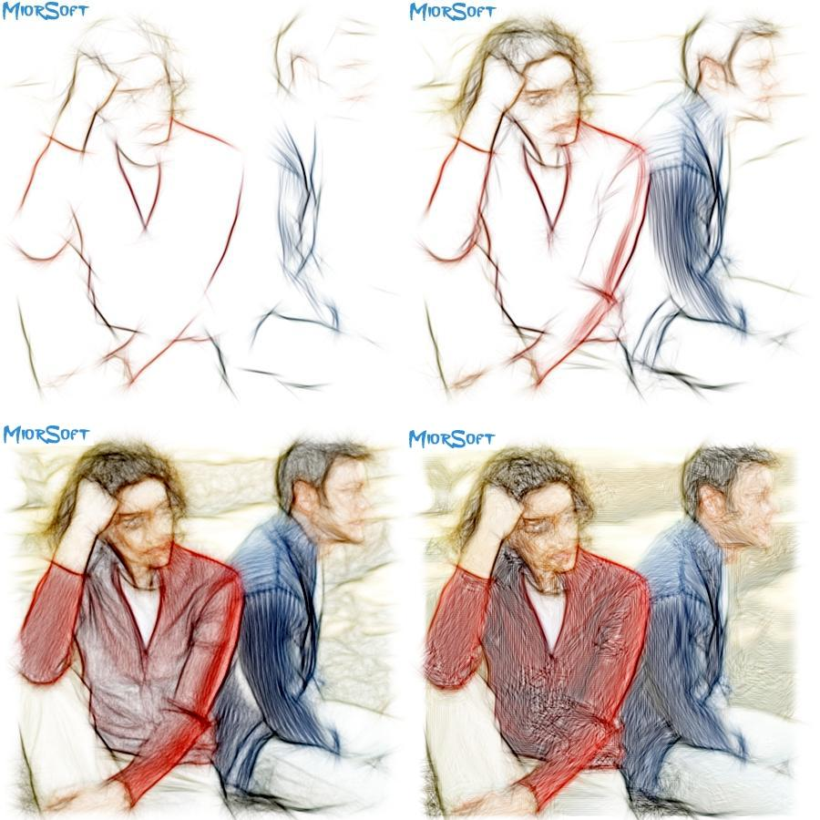



## SKETCHER 2ND \(V4\)

### Description

My Pencil Sketch Effect 2ND. (see Screenshot) (V4 new background mode) [Gabor Filter - SOBEL (Jähne et al. [1999] variation) ]
 
### More Info
 

             |
---                |---
**Submitted On**   |2011-10-03 16:06:34
**By**             |[reexre](https://github.com/Planet-Source-Code/PSCIndex/blob/master/ByAuthor/reexre.md)
**Level**          |Intermediate
**User Rating**    |5.0 (30 globes from 6 users)
**Compatibility**  |VB 6\.0
**Category**       |[Graphics](https://github.com/Planet-Source-Code/PSCIndex/blob/master/ByCategory/graphics__1-46.md)
**World**          |[Visual Basic](https://github.com/Planet-Source-Code/PSCIndex/blob/master/ByWorld/visual-basic.md)
**Archive File**   |[SKETCHER\_22212711092011\.zip](https://github.com/Planet-Source-Code/reexre-sketcher-2nd-v4__1-74103/archive/master.zip)

